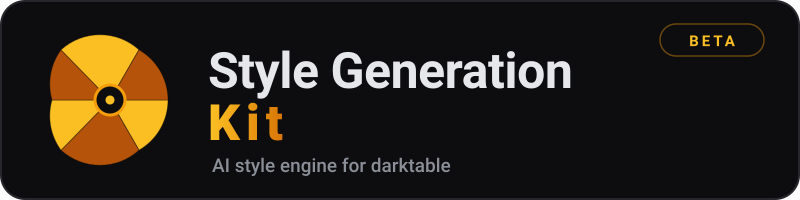

<p align="center">
  
</p>

# dtstylekit — AI-Powered Darktable Style Generator

> **⚠️ BETA / EXPERIMENTAL**
>
> dtstylekit is in **beta / experimental state**. It is built on a *vibe-coding* foundation: the codec and binary formats were reverse-engineered against the darktable source code. It can **fail when creating styles**, produce unexpected results, or generate `.dtstyle` files that do not behave as expected. Review the visual result of every generated style before using it in real work. See the [DISCLAIMERS](#disclaimers) section below.

A Python CLI tool that uses Vision Language Models (VLM) via Ollama to analyze photographs, select and compose from 534 existing Darktable presets, apply safe scalar adjustments on verified IOP structs, and output valid `.dtstyle` files with explanatory markdown reports.

> ## ⚠️ DISCLAIMERS
>
> ### 1. Experimental project
>
> **This project is TOTALLY EXPERIMENTAL.** It is built on a strong *vibe-coding* foundation: the code and binary formats have been reverse-engineered, verified, and adjusted iteratively against the darktable source code. It can **fail when creating styles**, produce unexpected results, or generate `.dtstyle` files that do not behave as expected. Use it with caution, always review the visual result, and back up your edits. Do not use it in professional workflows without validating each generated style first.
>
> ### 2. Ethical notice about photographers' styles
>
> **THIS SOFTWARE IS NOT MEANT TO COPY PHOTOGRAPHERS' STYLES. IT IS FOCUSED ON LEARNING HOW THOSE PHOTOGRAPHERS EDIT AT A TECHNICAL LEVEL. IF YOU LIKE THEM, BUY THEIR PRESETS OR THEIR PHOTOGRAPHS.**
>
> Reference photographs are used solely for educational and technical purposes: understanding which editing decisions (exposure, contrast, per-zone tonal color grading, saturation…) produce a given look. The goal is for you to learn how to edit, not to replicate anyone's commercial work.
>
> ### 3. Commitment to free software
>
> **EMPHASIS: THIS SOFTWARE WAS MADE FOR DARKTABLE, TO CONTRIBUTE TO FREE SOFTWARE AND SO THAT EVERYONE CAN EDIT THEIR RAWS FOR "FREE" AND IN AN OPEN WAY.**
>
> dtstylekit exists for the darktable community: democratizing RAW photography editing, teaching color-grading techniques, and letting anyone — without paying for licenses or commercial presets — understand and apply the techniques of great photographers. If you truly like a look, support its author by buying their work.

## Overview

This project pivots from "LLM generates binary blobs" to "VLM selects/composes verified presets + applies safe scalar adjustments." The VLM (default: `gemma3:27b`, customizable via `--model`) sees the image, describes the aesthetic, selects relevant presets from the **official darktable style library** (indexed locally via `setup.sh` — not vendored in this repository), and proposes parameter tweaks. The Python pipeline serializes the result using verified codec/struct layouts from Darktable source.

**Output:** Valid `.dtstyle` file + markdown report explaining the choices.

## Quickstart

### Prerequisites

- Python 3.11+
- [Ollama](https://ollama.ai/) installed and running locally
- Darktable installed (for testing round-trips)

### Setting up Ollama

If you don't have Ollama yet, install it:

- **Linux:**
  ```bash
  curl -fsSL https://ollama.ai/install.sh | sh
  ```
- **macOS:** Download from [ollama.ai](https://ollama.ai/) or `brew install ollama`
- **Windows:** Download from [ollama.ai](https://ollama.ai/)

Start the Ollama service (it runs in the background):

```bash
ollama serve  # starts the server (usually auto-starts after install)
```

Pull the default vision model:

```bash
ollama pull gemma3:27b
```

Verify it's working:

```bash
ollama run gemma3:27b "Describe this image" --image /path/to/a/photo.jpg
```

> Other compatible models: `llama3.2-vision:11b` (best for photos, ~8 GB VRAM), `gemma3:4b` (lightweight, ~4 GB), `llava:7b` (classic, ~6 GB). Switch with `--model` when running dtstylekit.

### Installation

```bash
# From the dtstylekit project root
pip install -e .[dev]
```

> **Note:** `pip install -e .[dev]` registers the `dtstylekit` CLI command via the `[project.scripts]` entry point. If `dtstylekit` is not found after installing, make sure the virtual environment is activated:
> ```bash
> source .venv/bin/activate
> # or if you use a different venv path:
> source /path/to/venv/bin/activate
> ```

### Preset library setup

dtstylekit indexes the **534 official darktable styles** (the `.dtstyle`
files in `data/styles/` of the darktable source tree) to build its
semantic search index. Those styles are *not* vendored into this
repository — you need a darktable checkout (or any directory containing
`.dtstyle` files) on your machine.

**What is `data/presets`?** It is a *symlink* (created by `./setup.sh`)
that points at your darktable checkout's `data/styles` directory — the
official style library dtstylekit indexes for semantic search. It is a
machine-specific pointer, not a directory of files: the styles themselves
live in your darktable checkout, so the symlink is gitignored and never
committed. Filling it is the first step of the setup below; if you prefer
no symlink at all, use the `DTSTYLEKIT_PRESETS_DIR` option (Option C).

**Option A — automatic (recommended):**

```bash
./setup.sh
```

The script locates the preset library (via `DTSTYLEKIT_PRESETS_DIR`, or a
darktable checkout containing `data/styles`, or an interactive prompt),
creates/repairs the `data/presets` symlink, verifies the files are
reachable, and builds the search index. It is idempotent — safe to run
again any time.

**Option B — manual:**

```bash
# 1. Clone darktable (or point at an existing checkout)
git clone https://github.com/darktable-org/darktable /path/to/darktable

# 2. Symlink the official styles into the expected location
ln -s /path/to/darktable/data/styles data/presets

# 3. Build the search index
dtstylekit preset index
```

**Option C — no symlink at all:** keep the library anywhere and point the
tool at it with the `DTSTYLEKIT_PRESETS_DIR` environment variable (or
`dtstylekit preset index --preset-dir <dir>`):

```bash
export DTSTYLEKIT_PRESETS_DIR=/path/to/darktable/data/styles
```

> The `data/presets` symlink in this repository points at
> `../../data/styles`, which only resolves when dtstylekit lives *inside*
> a darktable checkout (the layout this project was developed in). Use
> `./setup.sh` or `DTSTYLEKIT_PRESETS_DIR` for any other layout.

### Usage

```bash
# Analyze an image and generate a style (uses default model: gemma3:27b)
dtstylekit generate path/to/photo.jpg -o my_style.dtstyle

# Use a different VLM model
dtstylekit generate path/to/photo.jpg --model llama3.2-vision:11b -o my_style.dtstyle

# List available presets
dtstylekit presets list

# Search presets semantically
dtstylekit presets search "warm cinematic look"

# Generate a curve-based preset adjustment (e.g. tone curve, rgb curve, color zones)
dtstylekit curves --help

# Generate with reference-look images + a Spanish explanation document
dtstylekit generate photo.jpg --references 'refs/*.jpg' --direction "cinematic warm portrait" --lang es
```

> **Model customization:** The `--model` flag accepts any vision model available in Ollama. The default is `gemma3:27b` (good balance of quality and VRAM). Other good options: `llama3.2-vision:11b` (best for photos, ~8 GB VRAM), `gemma3:4b` (lightweight, ~4 GB), `llava:7b` (classic, ~6 GB).

### Supported darktable version

The binary layouts (IOP struct versions, blendop version, `module` fields)
are tightly coupled to a specific darktable build. This checkout targets
the darktable master that contains `dtstylekit/` — if you update
darktable, re-run the test suite first:

```bash
pytest tests/test_version_drift.py tests/test_real_presets.py
```

`test_version_drift.py` parses `DT_MODULE_INTROSPECTION` from
`src/iop/*.c` of the enclosing checkout and fails when the registry drifts
from the C sources (silently dropped modules are the classic symptom).
`test_real_presets.py` re-verifies blob sizes against the official styles
in `data/styles/`.

### Visual smoke check

Structural validation (XMP, blob sizes) proves a style *imports*, not
that it *renders*. After generating a style, run:

```bash
python tools/visual_check.py --style generated_styles/my_style.dtstyle
```

It renders a deterministic synthetic image through `darktable-cli` with
and without the style and fails on near-black/near-white/flat outputs.
Requires `darktable-cli` on `PATH` (skipped automatically in tests when
absent).

### Development

```bash
# Run tests
pytest

# Lint (must stay clean — CI enforces it)
ruff check .

# Type check (best-effort — the codebase has pre-existing typing debt;
# do not expect a fully clean run yet)
mypy dtstylekit --follow-imports=skip --ignore-missing-imports
```

## Architecture

```
dtstylekit/
├── cli.py                 # CLI entry point (generate/analyze, preset, vlm, curves)
├── paths.py               # Portable project-root path resolution
├── codec/                 # XMP codec, blendop blob, IOP registry, XML serializer
├── presets/               # Preset parser, SQLite indexer, embeddings, semantic search
├── analyzer/              # Image analysis (histogram, EXIF, luminance, noise, scene)
├── vlm/                   # Prompt builder, VLM client, orchestrator, validator, parser
├── composer/              # Style generator, merger, report, round-trip validator
├── curves/                # Curve templates + pack/unpack for curve-based IOPs
└── data/presets/          # Symlink to 534 .dtstyle files (darktable style library)
```

The default VLM is `gemma3:27b` (override with `--model`). Preset library,
`outputs/` (SQLite index + embeddings) and `generated_styles/` are resolved
relative to the project root via `dtstylekit/paths.py` and can be overridden
with the `DTSTYLEKIT_PRESETS_DIR` / `DTSTYLEKIT_OUTPUTS_DIR` environment
variables, so the CLI works from any working directory.

## Preset Library

dtstylekit indexes the **534 official darktable styles** (camera-specific styles for Canon, Nikon, Sony, Fujifilm, etc., film simulations, creative looks, and technical corrections). The library is **not vendored in this repository**: `./setup.sh` locates your darktable checkout and builds the search index (see [Preset library setup](#preset-library-setup)). Each preset is a valid Darktable `.dtstyle` file with verified XMP structure.

## VLM Integration

The VLM analyzes the input image and:
1. Describes the aesthetic (lighting, mood, color palette)
2. Selects 1-3 relevant presets from the library
3. Proposes scalar parameter adjustments on verified IOPs:
   - `filmicrgb` (tone mapping)
   - `colorbalancergb` (color grading)
   - `sigmoid` (contrast)
   - `exposure` (brightness)
   - `atrous` (sharpening/denoising)

## Output

Each run produces:
- **`.dtstyle` file** — Ready to import into Darktable
- **Markdown report** — Explains preset selection, parameter choices, and expected visual effect
- **`*_EXPLICACION.md` explanation document** — When `--references` are given, a natural-language narrative companion is auto-generated: it analyses the reference photographs (tonal key, contrast, saturation, white balance, per-zone hue grading) and explains in plain language how they are edited and why every module/parameter of the generated style was chosen. Language: `--lang es` (default) or `--lang en`.

## License

MIT License — see LICENSE file for details.
